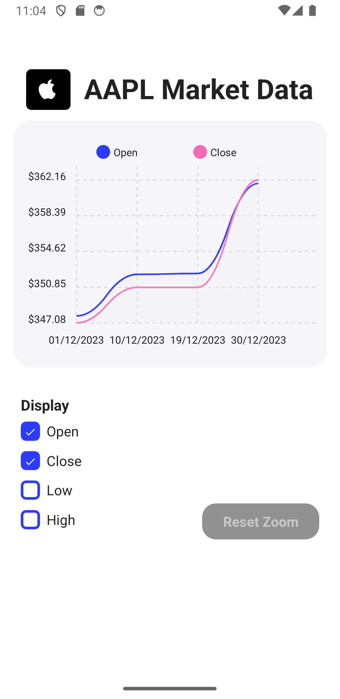
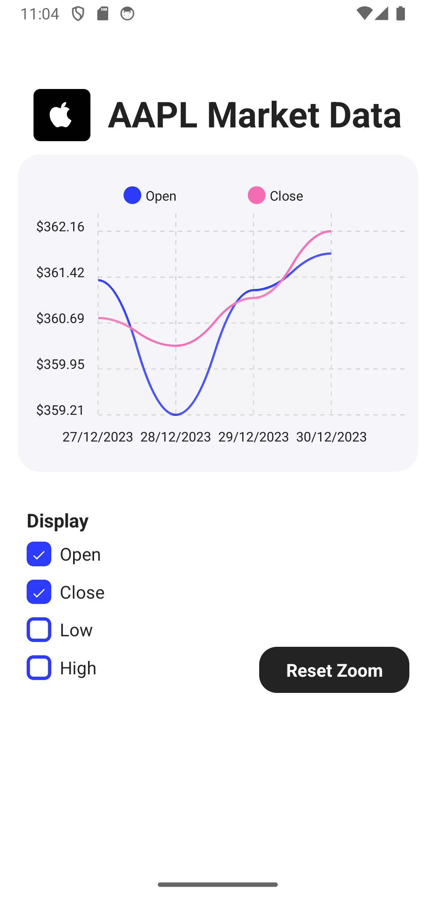

# EC Markets

A React Native application built with Expo for market analysis and visualization.




## Prerequisites

Before you begin, ensure you have the following installed:
- [Node.js](https://nodejs.org/) (LTS version recommended)
- [npm](https://www.npmjs.com/) (comes with Node.js)
- [Expo CLI](https://docs.expo.dev/get-started/installation/)
- [Expo Go](https://expo.dev/client) app on your mobile device (for testing)

## Installation

1. Clone the repository:
```bash
git clone <repository-url>
cd ec-markets
```

2. Install dependencies:
```bash
npm install
```

## Running the App

### Development Mode

1. Start the development server:
```bash
npm start
# or
expo start
```

2. You'll see a QR code in your terminal. You can:
   - Scan the QR code with your mobile device (using Expo Go app)
   - Press 'a' to open on Android emulator
   - Press 'i' to open on iOS simulator
   - Press 'w' to open in web browser

### Available Scripts

- `npm start` - Starts the Expo development server
- `npm run android` - Starts the app on Android
- `npm run ios` - Starts the app on iOS
- `npm run web` - Starts the app in web browser

## Dependencies

The project uses the following main dependencies:
- React Native
- Expo
- React Native Skia
- React Native Chart Kit
- React Native Reanimated
- Victory Native
- React Native SVG

## Troubleshooting

If you encounter any issues:

1. Clear the cache:
```bash
npx expo start -c
# or
npm start -- --reset-cache
```

2. Ensure all dependencies are properly installed:
```bash
npm install
```

3. Check for React version compatibility issues:
```bash
npm list react
```

## Development Notes

- The app uses React 19.0.0 and React Native 0.79.3
- Make sure to keep React and React Native versions in sync
- Use Expo Go for the best development experience

## Contributing

1. Fork the repository
2. Create your feature branch (`git checkout -b feature/AmazingFeature`)
3. Commit your changes (`git commit -m 'Add some AmazingFeature'`)
4. Push to the branch (`git push origin feature/AmazingFeature`)
5. Open a Pull Request

## License

This project is licensed under the MIT License - see the LICENSE file for details. 